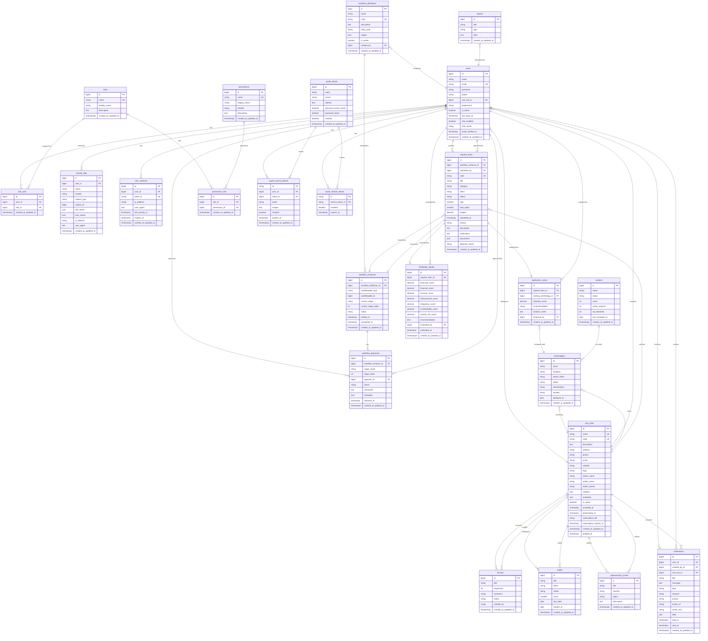

# Addis Smart Governance - Database Diagram

## Entity Relationship Diagram (ERD)

## Database Schema Summary

### Core Modules

#### 1. User Management & Authentication
- **users**: Core user accounts with MFA support
- **roles**: Role definitions (ITDB Admin, Sub-City Admin, Auditor, etc.)
- **permissions**: Granular permission system
- **role_user**: Many-to-many relationship between users and roles
- **permission_role**: Many-to-many relationship between roles and permissions
- **user_sessions**: Active user session tracking
- **oauth_***: OAuth 2.0 authentication tables (Laravel Passport)

#### 2. Sub-City Management
- **sub_cities**: Multi-tenant sub-city organizations
- Supports subscription tiers and activation status
- Tracks administrator details and custom settings

#### 3. Workflow System
- **workflow_definitions**: Reusable workflow templates with configurable stages
- **workflow_instances**: Active workflow executions (polymorphic)
- **workflow_approvals**: Individual approval actions at each stage
- Supports multi-stage approval processes with role-based routing

#### 4. Request Management
- **request_items**: Technology/service requests from sub-cities
- **duplication_cases**: Duplication analysis results
- **feasibility_studies**: Multi-criteria feasibility evaluations
- Integrated with workflow system for approval routing

#### 5. Technology & Vendor Management
- **technologies**: Deployed technology inventory
- **vendors**: Vendor performance tracking

#### 6. Audit & Compliance
- **audits**: Audit tracking and scoring
- **cybersecurity_issues**: Security incident management
- **activity_logs**: Comprehensive audit trail (polymorphic)

#### 7. Communication & Reporting
- **notifications**: Multi-channel notification system
- **surveys**: Survey management and sentiment analysis
- **reports**: Report generation and storage

## Key Relationships

1. **Multi-Tenancy**: Sub-cities contain users, technologies, and requests
2. **RBAC**: Users have roles, roles have permissions
3. **Workflow**: Polymorphic workflow instances can attach to any entity
4. **Request Processing**: Requests → Workflow → Duplication Analysis → Feasibility Study → Approval
5. **Audit Trail**: Activity logs track all changes via polymorphic relationships
6. **Notifications**: Users receive notifications about workflow actions and system events

## Indexes & Performance

Key indexes are applied on:
- Foreign keys for relationship queries
- User authentication (email, token_id)
- Activity logs (user_id + created_at, module + action)
- User sessions (user_id + last_activity_at)
- Workflow queries (status, current_stage)

## Security Features

- Password hashing
- Multi-factor authentication (MFA)
- OAuth 2.0 token management
- Session tracking and expiration
- Comprehensive activity logging
- Soft deletes on sub_cities
