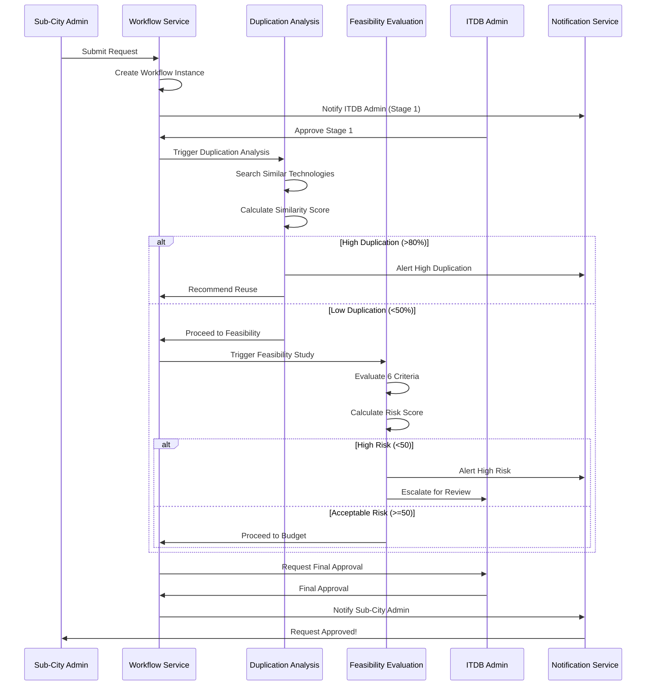

# Addis Smart Governance - Complete Implementation Guide

## Overview

This guide provides step-by-step instructions for implementing the complete workflow system based on the workflow diagrams and strict organizational hierarchy.

## System Architecture

### Core Components

1. **Workflow Engine** - Multi-stage approval system
2. **Duplication Analysis Service** - Automated similarity detection
3. **Feasibility Evaluation Service** - Multi-criteria risk assessment
4. **Notification System** - Multi-channel alerts
5. **Activity Logging** - Comprehensive audit trail
6. **Role-Based Access Control** - Hierarchical permissions

## Installation & Setup

### Step 1: Database Setup

```bash
# Run migrations
php artisan migrate

# Seed roles and permissions
php artisan db:seed --class=RolesAndPermissionsSeeder

# Seed workflow definitions
php artisan db:seed --class=WorkflowDefinitionSeeder
```

### Step 2: Create Initial Users

```bash
# Create ITDB Administrator (via tinker or seeder)
php artisan tinker
```

```php
$admin = \App\Models\User::create([
    'name' => 'ITDB Administrator',
    'email' => 'admin@itdb.gov.et',
    'password' => bcrypt('password'),
    'is_active' => true,
]);

$admin->assignRole('itdb_administrator');
```

### Step 3: Create Sub-Cities

```php
$subCity = \App\Models\SubCity::create([
    'name' => 'Addis Ketema',
    'code' => 'AK',
    'description' => 'Addis Ketema Sub-City',
    'is_active' => true,
    'activated_at' => now(),
]);
```

### Step 4: Create Sub-City Administrator

```php
$subCityAdmin = \App\Models\User::create([
    'name' => 'Addis Ketema Admin',
    'email' => 'admin@addisketema.gov.et',
    'password' => bcrypt('password'),
    'sub_city_id' => $subCity->id,
    'is_active' => true,
]);

$subCityAdmin->assignRole('sub_city_admin');
```

## Workflow Implementation

### Complete Request Approval Flow



### API Endpoints

#### 1. Submit Request

```http
POST /api/requests
Authorization: Bearer {token}
Content-Type: application/json

{
  "title": "Citizen Service Portal",
  "category": "Web Application",
  "office": "Addis Ketema",
  "priority": "High",
  "budget": 500000.00,
  "description": "Online portal for citizen services",
  "justification": "Improve service delivery and reduce wait times"
}
```

#### 2. Start Workflow

```http
POST /api/requests/{id}/submit
Authorization: Bearer {token}
```

**Response:**
```json
{
  "message": "Request submitted successfully",
  "data": {
    "id": 1,
    "code": "TR-2026-0001",
    "status": "Submitted",
    "approval_status": "pending",
    "workflow_instance": {
      "id": 1,
      "current_stage": "initial_review",
      "status": "in_progress"
    }
  }
}
```

#### 3. Perform Duplication Analysis

```http
POST /api/duplications/requests/{requestId}/analyze
Authorization: Bearer {token}
```

**Response:**
```json
{
  "message": "Duplication analysis completed",
  "data": {
    "id": 1,
    "request_item_id": 1,
    "existing_technology_id": 5,
    "similarity_score": 75.50,
    "recommendation": "extend",
    "analysis_notes": "Medium duplication detected..."
  }
}
```

#### 4. Conduct Feasibility Study

```http
POST /api/feasibility-studies/requests/{requestId}/evaluate
Authorization: Bearer {token}
Content-Type: application/json

{
  "technical_score": 85,
  "financial_score": 75,
  "security_score": 90,
  "infrastructure_score": 80,
  "integration_score": 70,
  "sustainability_score": 85
}
```

**Response:**
```json
{
  "message": "Feasibility evaluation completed",
  "data": {
    "id": 1,
    "request_item_id": 1,
    "overall_risk_score": 80.83,
    "recommendation": "RECOMMENDATION: APPROVE\n\nThe request demonstrates strong feasibility..."
  }
}
```

#### 5. Approve Workflow Stage

```http
POST /api/workflows/instances/{instanceId}/approve
Authorization: Bearer {token}
Content-Type: application/json

{
  "comments": "Approved after review",
  "metadata": {
    "reviewed_documents": true,
    "budget_verified": true
  }
}
```

#### 6. Reject Workflow

```http
POST /api/workflows/instances/{instanceId}/reject
Authorization: Bearer {token}
Content-Type: application/json

{
  "comments": "Budget exceeds allocated funds for this quarter",
  "metadata": {
    "reason_code": "BUDGET_EXCEEDED"
  }
}
```

#### 7. Request Revision

```http
POST /api/workflows/instances/{instanceId}/request-revision
Authorization: Bearer {token}
Content-Type: application/json

{
  "comments": "Please provide more details on integration requirements",
  "metadata": {
    "required_fields": ["integration_plan", "timeline"]
  }
}
```

## Role-Based Implementation

### ITDB Administrator Workflow

```php
// Create sub-city
$subCity = SubCity::create([...]);

// Assign ITDB Auditor
$auditor = User::create([...]);
$auditor->assignRole('itdb_auditor');

// View all requests (system-wide)
$requests = RequestItem::with('workflowInstance')->get();

// Final approval
$workflowService->approveStage($instance, $admin->id, 'Final approval granted');

// Override decision
if ($admin->canOverrideWorkflows()) {
    $workflowService->completeWorkflow($instance);
}
```

### ITDB Auditor Workflow

```php
// Perform duplication analysis
$case = $duplicationService->analyzeRequest($request);

// Conduct feasibility study
$scores = [
    'technical' => 85,
    'financial' => 75,
    'security' => 90,
    'infrastructure' => 80,
    'integration' => 70,
    'sustainability' => 85,
];
$study = $feasibilityService->evaluateRequest($request, $scores);

// Approve at evaluation stage
if ($auditor->canApproveWorkflows()) {
    $workflowService->approveStage($instance, $auditor->id, 'Evaluation complete');
}
```

### Sub-City Administrator Workflow

```php
// Create request (own sub-city only)
$request = RequestItem::create([
    'title' => 'New System',
    'office' => $admin->subCity->name,
    'submitted_by' => $admin->id,
    ...
]);

// Submit for approval
$workflowService->initializeWorkflow('tech_request_approval', $request);

// View own sub-city requests only
$requests = RequestItem::where('office', $admin->subCity->name)->get();

// Track workflow progress
$instance = $request->workflowInstance;
$currentStage = $instance->current_stage;
$approvals = $instance->approvals;
```

### Sub-City Auditor Workflow

```php
// Create survey
$survey = Survey::create([
    'title' => 'Citizen Satisfaction Survey',
    'sub_city_id' => $auditor->sub_city_id,
    ...
]);

// Collect field data
$technology->update([
    'status' => 'active',
    'deployed_at' => now(),
    'location' => 'Collected from field visit',
]);

// Encode system usage data
ActivityLog::log('data_collection', 'technologies', $technology);
```

## Security Implementation

### Permission Checks in Controllers

```php
public function index(Request $request)
{
    $user = auth()->user();
    
    // Check permission
    if (!$user->hasPermission('view_requests')) {
        abort(403, 'Unauthorized');
    }
    
    $query = RequestItem::query();
    
    // Apply sub-city scope for sub-city users
    if ($user->isSubCityUser()) {
        $query->where('office', $user->subCity->name);
    }
    
    return response()->json($query->paginate());
}
```

### Workflow Stage Authorization

```php
public function approve(Request $request, string $instanceId)
{
    $instance = WorkflowInstance::findOrFail($instanceId);
    $user = auth()->user();
    
    // Check if user can approve this stage
    $currentStage = $instance->definition->getStage($instance->current_stage);
    $requiredRole = $currentStage['required_role'] ?? null;
    
    if ($requiredRole && !$user->hasRole($requiredRole)) {
        return response()->json([
            'message' => 'You do not have permission to approve this stage',
            'required_role' => $requiredRole,
            'your_roles' => $user->roles->pluck('name'),
        ], 403);
    }
    
    // Approve
    $workflowService->approveStage($instance, $user->id, $request->comments);
    
    return response()->json(['message' => 'Stage approved']);
}
```

### Sub-City Data Isolation

```php
// In RequestItemController
public function index(Request $request)
{
    $user = auth()->user();
    $query = RequestItem::query();
    
    // ITDB users see all requests
    if ($user->isITDBUser()) {
        // No filtering
    }
    // Sub-city users see only their sub-city
    elseif ($user->isSubCityUser()) {
        $query->where('office', $user->subCity->name);
    }
    else {
        // No access
        abort(403);
    }
    
    return response()->json($query->paginate());
}
```

## Testing the Workflow

### Test Scenario 1: Complete Approval Flow

```bash
# 1. Sub-City Admin creates request
POST /api/requests
{
  "title": "Test Request",
  "category": "Software",
  "office": "Addis Ketema",
  "priority": "High",
  "budget": 100000,
  "description": "Test description",
  "justification": "Test justification"
}

# 2. Sub-City Admin submits request
POST /api/requests/1/submit

# 3. ITDB Admin approves Stage 1
POST /api/workflows/instances/1/approve
{
  "comments": "Initial review passed"
}

# 4. System performs duplication analysis
POST /api/duplications/requests/1/analyze

# 5. ITDB Auditor conducts feasibility study
POST /api/feasibility-studies/requests/1/evaluate
{
  "technical_score": 85,
  "financial_score": 80,
  "security_score": 90,
  "infrastructure_score": 75,
  "integration_score": 80,
  "sustainability_score": 85
}

# 6. ITDB Admin provides final approval
POST /api/workflows/instances/1/approve
{
  "comments": "Final approval granted"
}

# 7. Check final status
GET /api/requests/1
```

### Test Scenario 2: Rejection Flow

```bash
# ITDB Admin rejects at any stage
POST /api/workflows/instances/1/reject
{
  "comments": "Budget not justified"
}

# Verify rejection
GET /api/requests/1
# Should show status: "Rejected"
```

### Test Scenario 3: Revision Request

```bash
# ITDB Auditor requests revision
POST /api/workflows/instances/1/request-revision
{
  "comments": "Need more technical details"
}

# Sub-City Admin updates request
PUT /api/requests/1
{
  "description": "Updated with more details..."
}

# Sub-City Admin resubmits
POST /api/requests/1/submit
```

## Monitoring & Analytics

### Workflow Analytics

```http
GET /api/workflows/analytics
```

**Response:**
```json
{
  "data": {
    "total_instances": 150,
    "in_progress": 25,
    "approved": 100,
    "rejected": 20,
    "revision_requested": 5,
    "approval_rate": 66.67,
    "avg_completion_hours": 72.5
  }
}
```

### Duplication Statistics

```http
GET /api/duplications/statistics
```

**Response:**
```json
{
  "data": {
    "total_analyses": 100,
    "high_duplication": 15,
    "medium_duplication": 30,
    "low_duplication": 55,
    "recommendations": {
      "reuse": 15,
      "extend": 30,
      "new": 55
    },
    "duplication_rate": 45.00
  }
}
```

### Feasibility Statistics

```http
GET /api/feasibility-studies/statistics
```

**Response:**
```json
{
  "data": {
    "total_evaluations": 85,
    "risk_distribution": {
      "low": 50,
      "medium": 25,
      "high": 10
    },
    "average_scores": {
      "technical": 78.50,
      "financial": 72.30,
      "security": 85.20,
      "infrastructure": 70.10,
      "integration": 75.40,
      "sustainability": 80.60,
      "overall": 77.02
    }
  }
}
```

## Troubleshooting

### Common Issues

#### 1. Permission Denied Errors

**Problem:** User cannot access endpoint
**Solution:** Check role and permissions

```php
$user = User::find($userId);
$user->roles; // Check assigned roles
$user->getAllPermissions(); // Check all permissions
```

#### 2. Sub-City Scope Not Working

**Problem:** Sub-city user sees other sub-city data
**Solution:** Ensure SubCityScope middleware is applied

```php
// In routes/api.php
Route::middleware(['auth:api', 'subcity.scope'])->group(function () {
    // Protected routes
});
```

#### 3. Workflow Not Advancing

**Problem:** Workflow stuck at a stage
**Solution:** Check stage configuration and approver role

```php
$instance = WorkflowInstance::find($id);
$currentStage = $instance->definition->getStage($instance->current_stage);
$requiredRole = $currentStage['required_role'];
// Ensure user with this role approves
```

## Best Practices

### 1. Always Log Activities

```php
ActivityLog::log('action', 'module', $subject, $oldValues, $newValues);
```

### 2. Send Notifications

```php
NotificationService::notifyStageApprovers($instance, $requiredRole);
```

### 3. Validate Permissions

```php
if (!$user->hasPermission('required_permission')) {
    abort(403);
}
```

### 4. Apply Sub-City Scope

```php
if ($user->isSubCityUser()) {
    $query->where('sub_city_id', $user->sub_city_id);
}
```

### 5. Use Transactions

```php
DB::transaction(function () use ($data) {
    // Multiple database operations
});
```

## Deployment Checklist

- [ ] Run all migrations
- [ ] Seed roles and permissions
- [ ] Seed workflow definitions
- [ ] Create ITDB Administrator account
- [ ] Create sub-cities
- [ ] Assign sub-city administrators
- [ ] Configure notification channels
- [ ] Set up activity log retention
- [ ] Configure backup schedule
- [ ] Test all workflow stages
- [ ] Verify permission enforcement
- [ ] Test sub-city isolation
- [ ] Review audit logs
- [ ] Configure monitoring alerts

## Support & Maintenance

### Regular Tasks

1. **Daily:** Monitor workflow progress
2. **Weekly:** Review audit logs
3. **Monthly:** Generate analytics reports
4. **Quarterly:** Review and update permissions
5. **Annually:** Archive old data

### Performance Optimization

1. Index frequently queried columns
2. Cache workflow definitions
3. Optimize notification delivery
4. Archive completed workflows
5. Clean up old activity logs

---

**Document Version:** 1.0  
**Last Updated:** May 14, 2026  
**Maintained By:** ITDB Development Team
