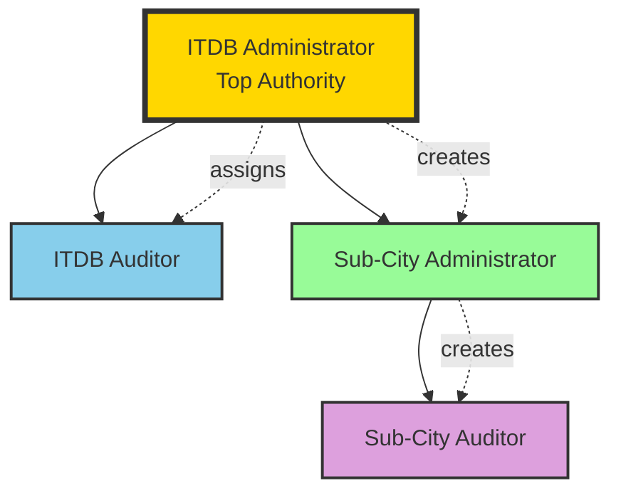

# Addis Smart Governance - System Hierarchy & Roles

## Organizational Hierarchy



## Role Definitions & Permissions

### 1. ITDB Administrator (Top Authority)

**Hierarchy Level:** 1 (Highest)

**Core Responsibilities:**
- System-wide governance and oversight
- Strategic decision-making
- Final approval authority
- Sub-city management
- Auditor assignment and management

**Permissions:**

#### Sub-City Management
- ✅ Create new sub-cities
- ✅ Edit sub-city details
- ✅ Activate/deactivate sub-cities
- ✅ View all sub-city data
- ✅ Delete sub-cities (with safeguards)
- ✅ Assign sub-city administrators

#### User Management
- ✅ Create ITDB auditors
- ✅ Create sub-city administrators
- ✅ View all users across system
- ✅ Edit any user
- ✅ Activate/deactivate users
- ✅ Reset passwords
- ✅ Assign roles and permissions

#### Request Management
- ✅ View all technology requests (all sub-cities)
- ✅ Final approval on all requests
- ✅ Override any workflow decision
- ✅ Reject requests at any stage
- ✅ Request revisions
- ✅ Cancel workflows

#### Workflow Management
- ✅ Create workflow definitions
- ✅ Edit workflow stages
- ✅ Activate/deactivate workflows
- ✅ View all workflow instances
- ✅ Approve at any stage
- ✅ Escalate workflows

#### Analytics & Reporting
- ✅ View system-wide analytics
- ✅ View all sub-city reports
- ✅ Generate consolidated reports
- ✅ Export all data
- ✅ View audit trails

#### System Configuration
- ✅ Manage system settings
- ✅ Configure modules
- ✅ Set approval thresholds
- ✅ Define policies

---

### 2. ITDB Auditor

**Hierarchy Level:** 2

**Core Responsibilities:**
- Technical evaluation and analysis
- Feasibility studies
- Duplication analysis
- Compliance verification
- Recommendation provision

**Permissions:**

#### Request Evaluation
- ✅ View all technology requests
- ✅ Perform feasibility studies
- ✅ Conduct duplication analysis
- ✅ Provide technical recommendations
- ✅ Approve/reject at evaluation stages
- ❌ Cannot make final approval (only ITDB Admin)

#### Feasibility Studies
- ✅ Evaluate technical feasibility
- ✅ Assess financial viability
- ✅ Conduct security analysis
- ✅ Review infrastructure readiness
- ✅ Evaluate integration complexity
- ✅ Assess sustainability

#### Duplication Analysis
- ✅ Search existing technologies
- ✅ Calculate similarity scores
- ✅ Recommend reuse/extend/new
- ✅ Override automated analysis
- ✅ Document analysis findings

#### Audit Functions
- ✅ Conduct system audits
- ✅ Review sub-city compliance
- ✅ Generate audit reports
- ✅ Track audit findings
- ✅ Verify remediation

#### Reporting
- ✅ View system-wide data
- ✅ Generate evaluation reports
- ✅ Export analysis data
- ❌ Cannot view sensitive admin data

---

### 3. Sub-City Administrator

**Hierarchy Level:** 3

**Core Responsibilities:**
- Manage assigned sub-city
- Submit technology requests
- Oversee sub-city operations
- Manage sub-city auditors
- Monitor sub-city performance

**Permissions:**

#### Sub-City Management
- ✅ View own sub-city details
- ✅ Edit sub-city information (limited)
- ✅ Manage sub-city settings
- ❌ Cannot create new sub-cities
- ❌ Cannot view other sub-cities (unless granted)

#### User Management (Sub-City Scope)
- ✅ Create sub-city auditors
- ✅ View sub-city users
- ✅ Edit sub-city user details
- ✅ Activate/deactivate sub-city users
- ❌ Cannot create ITDB users
- ❌ Cannot view users from other sub-cities

#### Request Management (Sub-City Scope)
- ✅ Create technology requests
- ✅ Submit requests for approval
- ✅ Edit draft requests
- ✅ View own sub-city requests
- ✅ Track request status
- ✅ Resubmit after revision
- ❌ Cannot approve requests
- ❌ Cannot view other sub-city requests

#### Technology Registry (Sub-City Scope)
- ✅ View sub-city technologies
- ✅ Register new technologies
- ✅ Update technology information
- ❌ Cannot view other sub-city technologies

#### Reporting (Sub-City Scope)
- ✅ View sub-city analytics
- ✅ Generate sub-city reports
- ✅ Export sub-city data
- ❌ Cannot view system-wide reports
- ❌ Cannot view other sub-city data

#### Workflow Tracking
- ✅ View sub-city workflow instances
- ✅ Track approval progress
- ✅ Receive notifications
- ❌ Cannot approve workflows
- ❌ Cannot modify workflow stages

---

### 4. Sub-City Auditor

**Hierarchy Level:** 4 (Lowest)

**Core Responsibilities:**
- Data collection and encoding
- Survey management
- Field data gathering
- Citizen feedback collection
- Operational audit support

**Permissions:**

#### Survey Management (Sub-City Scope)
- ✅ Create surveys
- ✅ Collect survey responses
- ✅ Encode survey data
- ✅ View survey results
- ✅ Generate survey reports

#### Data Collection (Sub-City Scope)
- ✅ Encode system usage data
- ✅ Record technology deployments
- ✅ Document field observations
- ✅ Collect citizen feedback
- ✅ Update technology status

#### Audit Support (Sub-City Scope)
- ✅ Assist in operational audits
- ✅ Gather audit evidence
- ✅ Document findings
- ✅ Track remediation actions
- ❌ Cannot conduct formal audits (ITDB Auditor role)

#### Reporting (Sub-City Scope - Limited)
- ✅ View sub-city data
- ✅ Generate basic reports
- ❌ Cannot view sensitive data
- ❌ Cannot export system data
- ❌ Cannot view other sub-cities

#### Request Tracking (Sub-City Scope - Read Only)
- ✅ View sub-city requests
- ✅ Track request status
- ❌ Cannot create requests
- ❌ Cannot edit requests
- ❌ Cannot approve requests

---

## Workflow Approval Matrix

| Stage | ITDB Admin | ITDB Auditor | Sub-City Admin | Sub-City Auditor |
|-------|------------|--------------|----------------|------------------|
| **Initial Review** | ✅ Approve/Reject | ✅ Review | ❌ View Only | ❌ View Only |
| **Duplication Analysis** | ✅ Override | ✅ Perform Analysis | ❌ View Only | ❌ No Access |
| **Feasibility Study** | ✅ Override | ✅ Conduct Evaluation | ❌ View Only | ✅ Provide Data |
| **Budget Approval** | ✅ Approve/Reject | ✅ Recommend | ❌ View Only | ❌ No Access |
| **Final Approval** | ✅ Approve/Reject | ❌ View Only | ❌ View Only | ❌ No Access |

---

## Data Access Scope

### ITDB Administrator
- **Scope:** System-wide (all sub-cities)
- **Access Level:** Full (read, write, delete)
- **Override:** Can override any decision

### ITDB Auditor
- **Scope:** System-wide (all sub-cities)
- **Access Level:** Read + Evaluate
- **Override:** Can override automated analysis

### Sub-City Administrator
- **Scope:** Own sub-city only
- **Access Level:** Full within sub-city
- **Override:** Cannot override workflow decisions

### Sub-City Auditor
- **Scope:** Own sub-city only
- **Access Level:** Read + Data Entry
- **Override:** No override capabilities

---

## Permission Hierarchy Rules

### Rule 1: Hierarchical Inheritance
- Higher roles can perform all actions of lower roles within their scope
- ITDB Admin > ITDB Auditor > Sub-City Admin > Sub-City Auditor

### Rule 2: Scope Isolation
- Sub-city users cannot access other sub-city data
- ITDB users can access all sub-city data

### Rule 3: Approval Authority
- Only ITDB Administrator can make final approvals
- ITDB Auditors provide recommendations, not final decisions
- Sub-city users cannot approve their own requests

### Rule 4: Override Authority
- Only ITDB Administrator can override workflow decisions
- ITDB Auditors can override automated analysis only
- Sub-city users have no override capabilities

### Rule 5: User Management
- ITDB Admin creates: ITDB Auditors, Sub-City Admins
- Sub-City Admin creates: Sub-City Auditors (own sub-city only)
- Users cannot create users at their own level or higher

---

## Security Enforcement

### Middleware Stack
1. **Authentication:** Verify user identity
2. **Role Check:** Verify user has required role
3. **Permission Check:** Verify user has specific permission
4. **Scope Check:** Verify user can access the resource (sub-city isolation)
5. **Activity Logging:** Log all actions for audit trail

### Sub-City Isolation
```php
// Automatic scope filtering for sub-city users
if ($user->isSubCityUser()) {
    $query->where('sub_city_id', $user->sub_city_id);
}
```

### Permission Checks
```php
// Role-based permission check
if (!$user->hasRole('itdb_administrator')) {
    abort(403, 'Unauthorized');
}

// Permission-based check
if (!$user->hasPermission('approve_requests')) {
    abort(403, 'Insufficient permissions');
}
```

### Workflow Stage Authorization
```php
// Check if user can approve current stage
$requiredRole = $workflow->getCurrentStageRole();
if (!$user->hasRole($requiredRole)) {
    abort(403, 'You cannot approve this stage');
}
```

---

## Notification Routing

### ITDB Administrator
- All system events
- High-priority issues
- Final approval requests
- System alerts

### ITDB Auditor
- Evaluation requests
- Duplication alerts
- Feasibility study assignments
- Audit schedules

### Sub-City Administrator
- Sub-city request status updates
- Approval/rejection notifications
- Revision requests
- Sub-city alerts

### Sub-City Auditor
- Survey assignments
- Data collection tasks
- Audit support requests
- Sub-city operational updates

---

## Audit Trail Requirements

All actions must be logged with:
- User ID and role
- Action performed
- Resource affected
- Timestamp
- IP address
- Old and new values (for updates)
- Sub-city context (if applicable)

### Critical Actions Requiring Audit
- User creation/modification
- Role assignments
- Request approvals/rejections
- Workflow overrides
- Sub-city creation/modification
- System setting changes
- Data exports
- Permission changes
