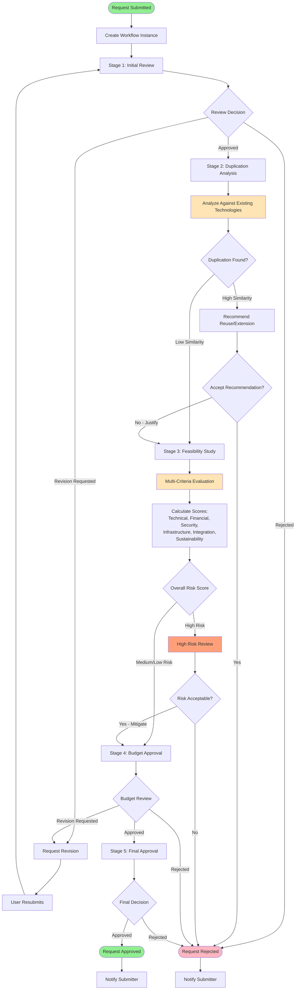
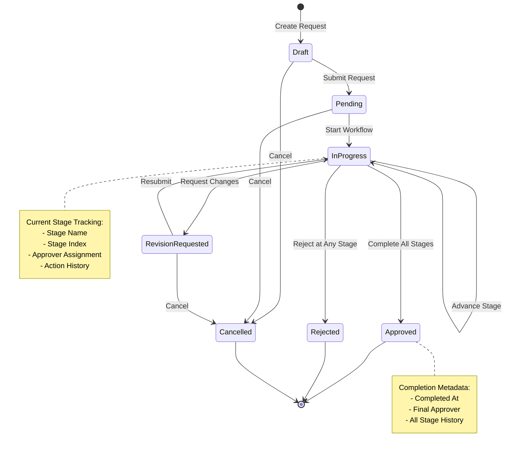
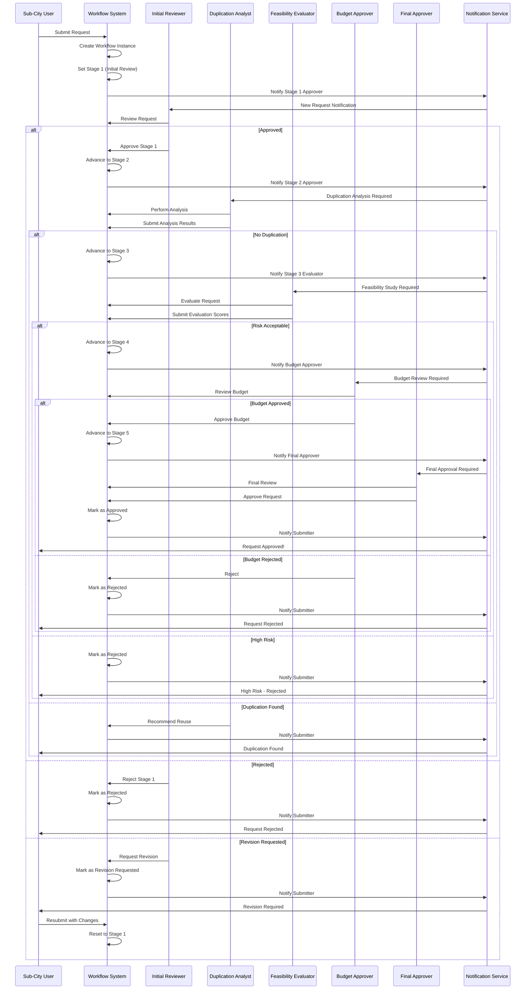
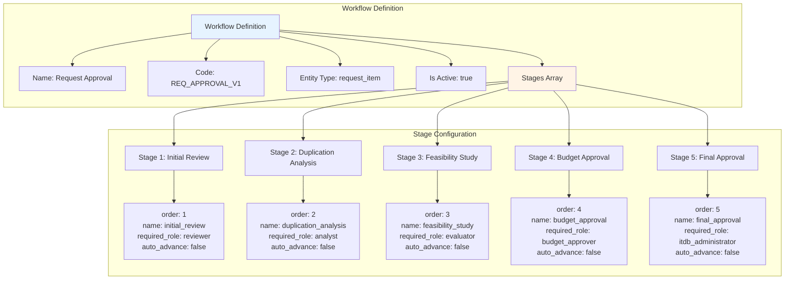
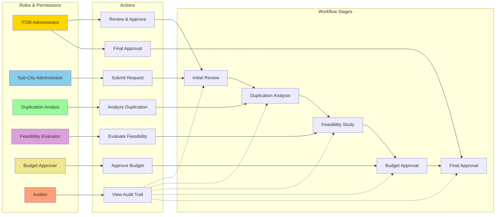
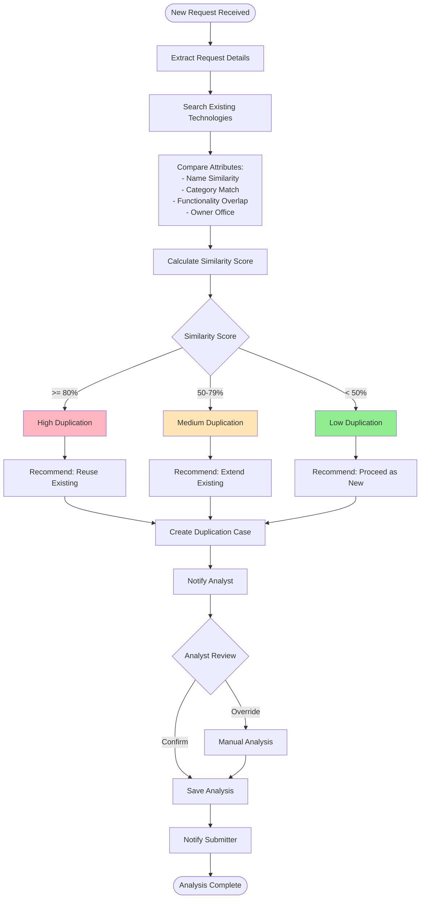
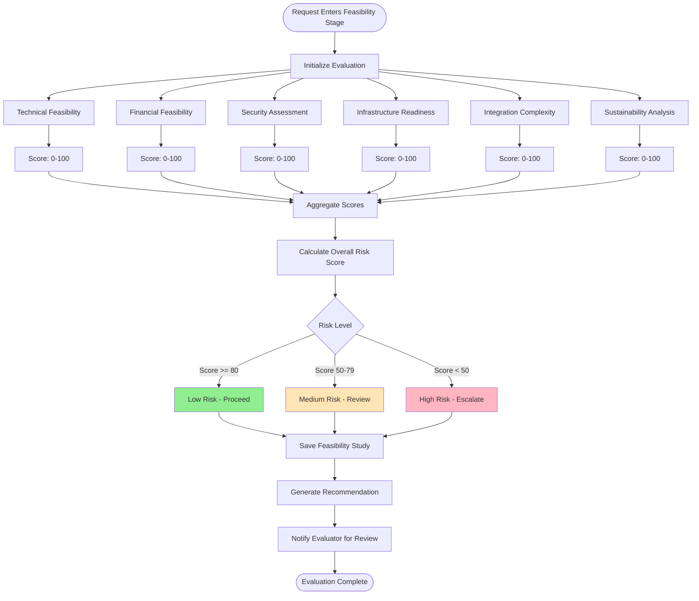
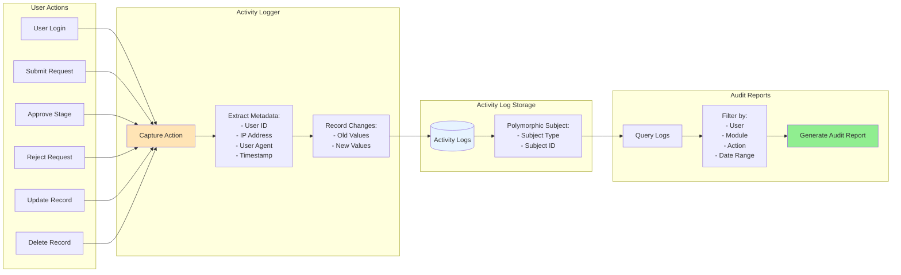
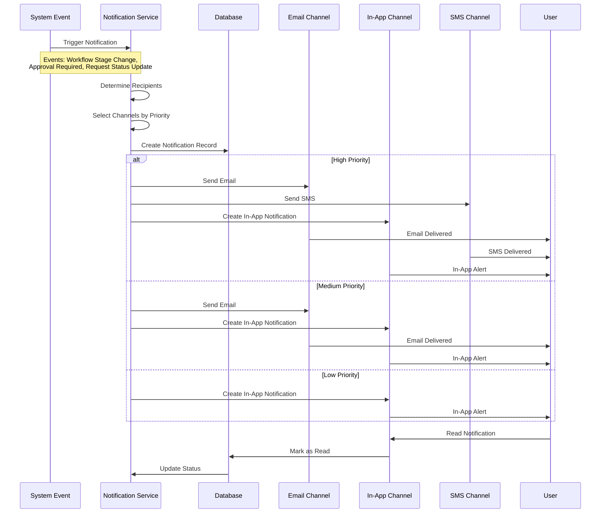

# Addis Smart Governance - Workflow Diagrams

## 1. Request Approval Workflow

## 2. Workflow Instance State Machine

## 3. Multi-Stage Approval Process

## 4. Workflow Definition Structure

## 5. Role-Based Workflow Routing

## 6. Duplication Analysis Workflow

## 7. Feasibility Study Evaluation

## 8. Activity Logging & Audit Trail

## 9. Notification Flow

## Workflow System Features

### Key Capabilities

1. **Flexible Workflow Definitions**
   - Reusable workflow templates
   - Configurable stages with role-based routing
   - Support for multiple entity types (polymorphic)

2. **Multi-Stage Approval**
   - Sequential stage progression
   - Role-based approver assignment
   - Approval, rejection, and revision request actions

3. **Duplication Prevention**
   - Automated similarity analysis
   - Comparison with existing technologies
   - Recommendation engine (reuse/extend/new)

4. **Risk Assessment**
   - Multi-criteria feasibility evaluation
   - Weighted scoring system
   - Risk-based routing and escalation

5. **Audit & Compliance**
   - Complete activity logging
   - Polymorphic subject tracking
   - Comprehensive audit trail

6. **Notification System**
   - Multi-channel delivery (email, SMS, in-app)
   - Priority-based routing
   - Read/unread tracking

### Workflow States

- **Draft**: Initial creation, not yet submitted
- **Pending**: Submitted, awaiting workflow start
- **In Progress**: Active workflow, moving through stages
- **Revision Requested**: Changes required, returned to submitter
- **Approved**: Successfully completed all stages
- **Rejected**: Denied at any stage
- **Cancelled**: Withdrawn by submitter or admin

### Stage Actions

- **Approve**: Move to next stage
- **Reject**: Terminate workflow
- **Request Revision**: Return to submitter for changes
- **Pending**: Awaiting action from approver
